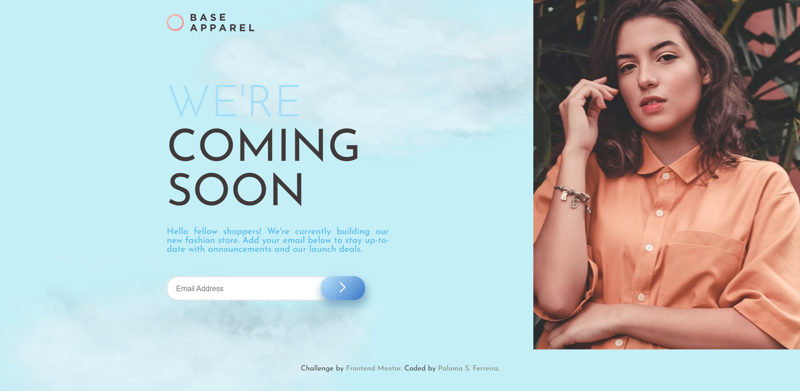
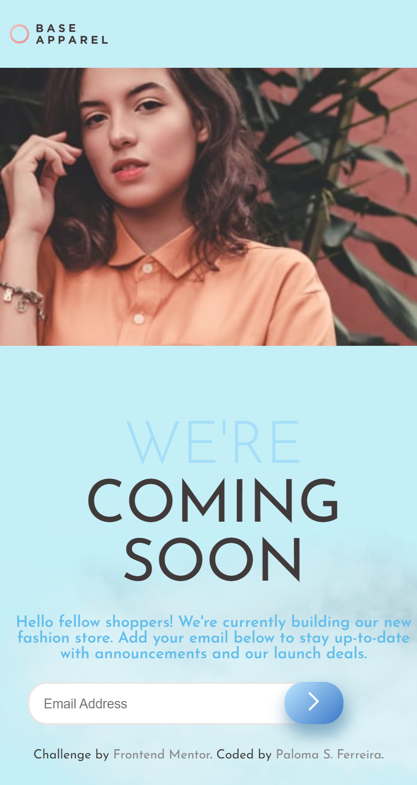

<h1 align='center'>Tela de Email </h1>

 
 

  
   

# Índice

- [Descrição do Projeto](#descrição-do-projeto)
- [Tecnologias utilizadas](#tecnologias-utilizadas)
- [Autor](#author)

# Descrição do Projeto

Uma Tela de Email  simples  de maneira responsiva com o uso de Flexbox e Grid, validado com js.

obs: projeto original no <a href="https://www.frontendmentor.io/challenges/base-apparel-coming-soon-page-5d46b47f8db8a7063f9331a0"> site </a>

 # Tecnologias utilizadas
- HTML e CSS
- Git e Github
- JS

# Autor
 Paloma Santos Ferreira 